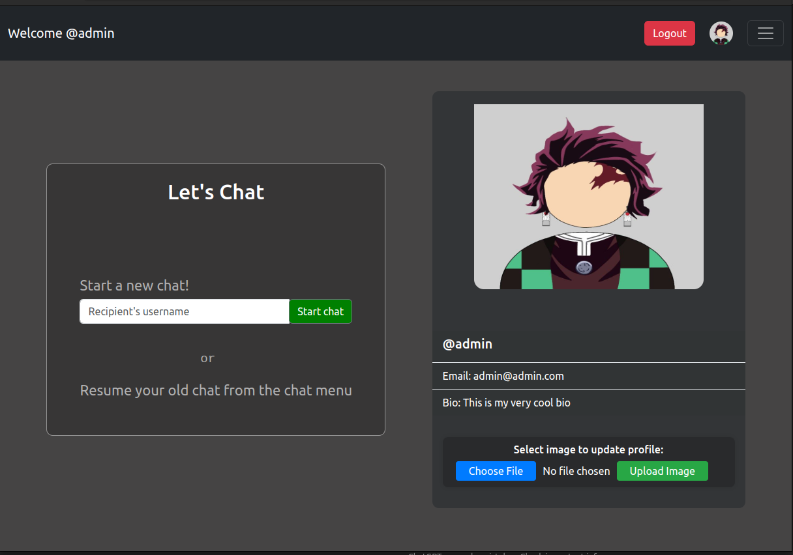
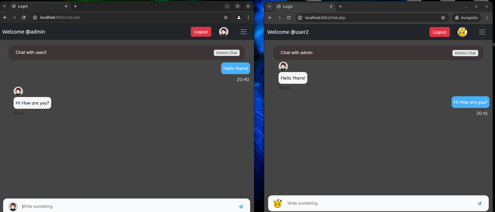

## Echo.php
*A simple personalized one-to-one chat application written in php.*


It uses Ratchet library for the websocket server implementation. Sqlite is used as the database and bootstrap is used for styling. 

The app ui is simple, you are logged into the dashboard after signing in.



On the dashboard page you are given option to start a new chat or to load an old chat. On starting a new chat or loading an old one, you are redirected to the chat page. 



In this chat page, you can chat with the other person, delete the chat or to open an another chat.

### Intresting problem

While making the websocket server, I encountered an intresting problem. The Ratchet library in php is well suited for making a giant chat room, but not so much for one-to-one chats that no one other can sneak on. Although i tried implementing this using the target connection id in a chat room, that didn't quite worked because whenever a person refreshes the page, his connection id is reseted. So what i finally did was created rooms' id which is a encrypted string of usernames of both users in a chat and send the message to only users having the same room id.

### Local set-up

Firstly clone the repo using this command
```bash
git clone git@github.com:KapilSareen/Echo.php.git
```
Now open a terminal window in the source directory and start the websocket server using  this command

```php
php server/chat-server.php
```
Open another terminal window and start the app server using these commands
```php
cd app
php -S locahost:8000
```
This will start the app server on your locahost port 8000. Now access the app from your browser using this url:  `http;//locahost:8000` 